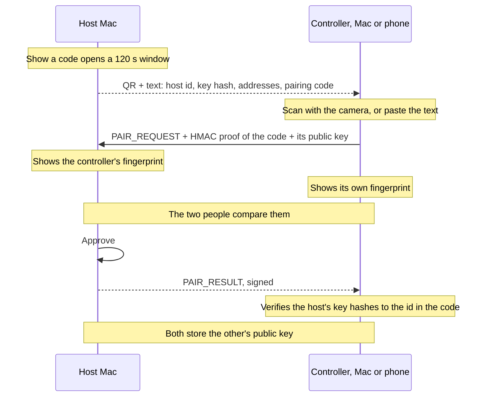
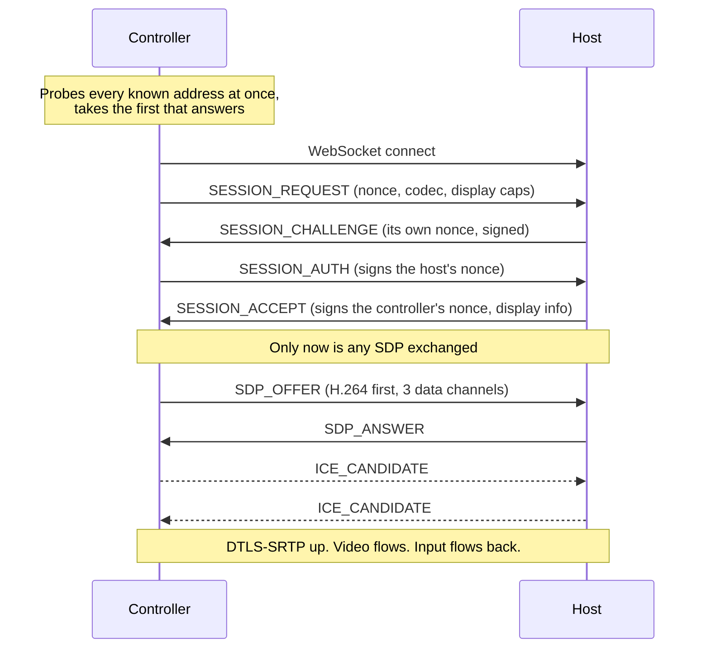
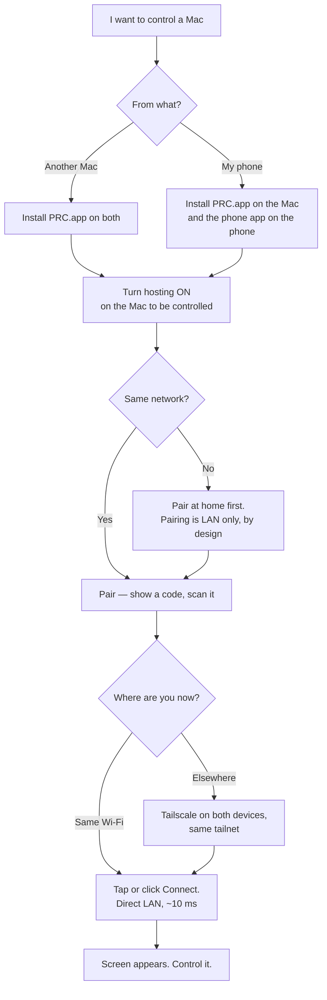

# PRC: Personal Remote Control

Private, self-hosted remote control for your own machines. A Mac shows its screen to another Mac
or to an Android phone, and takes that device's mouse, trackpad, touch and keyboard. Nothing is
published, no account is created, no third party is involved, and no remote-control port is ever
exposed to the Internet.

Screen and input travel only inside an encrypted WebRTC connection. Every message that sets up a
session is signed by a per-device key, so neither the network, nor a relay, nor anything in the
middle can impersonate a device, read a session, or inject a keystroke.

- The design: [docs/spec.md](docs/spec.md)
- What was built and what it cost to learn: [docs/implementation.md](docs/implementation.md)

**Contents** — [The devices](#1-the-devices) · [Technology](#2-technology) ·
[Architecture](#3-architecture) · [The two halves](#4-the-two-halves-hosting-and-controlling) ·
[Full flow](#5-full-flow-from-a-cold-machine-to-a-moving-picture) ·
[User guide](#6-user-guide) · [Repository](#7-repository-layout) ·
[Building and testing](#8-building-and-testing) · [Security rules](#9-security-rules) ·
[Not built](#10-not-built)

---

## 1. The devices

| Device | Runs | Can host | Can control |
|---|---|---|---|
| Mac mini | `PRC.app` | yes | yes |
| MacBook | `PRC.app` | yes | yes |
| Android phone | `PRC` (`com.prc.controller`) | no | yes |

One Mac app fills both roles. A Mac can be controlled, control another, or do both at once.
Hosting is a switch that is **off** until you turn it on, so installing the app never makes a Mac
remotely controllable on its own. The phone only controls, which is why its app is much smaller.

---

## 2. Technology

### Shared, and the reason it is shared

| Piece | Choice | Why |
|---|---|---|
| Identity key | ECDSA P-256, SHA-256 | The curve both the Secure Enclave and the Android Keystore back in hardware. Ed25519 is backed by neither. |
| Signature format | Raw `r‖s`, 64 bytes, base64url | Identical on three platforms; Android converts from DER |
| Device id | SHA-256 of the 65-byte X9.63 public key | Self-certifying: the id proves which key it belongs to |
| Fingerprint | The first 12 hex characters as `8C65-1C4E-DC44` | Short enough to compare by eye across a room |
| Wire format | JSON envelope, payload as base64url of the exact bytes | Avoids needing canonical JSON in three languages |
| Source of truth | JSON Schema in `packages/protocol` | Codegen produces TypeScript types and the Swift key table, so they cannot drift |
| Cross-platform proof | Shared test vectors | The same vectors are run by TypeScript, Swift and Kotlin |
| Media | WebRTC, H.264, DTLS-SRTP | Hardware encode on the Mac, hardware decode on the Mac and the phone |
| Pairing proof | HMAC-SHA256 over the pairing code | Proves possession of the code without sending it |

### On the Mac

| Layer | Technology |
|---|---|
| Language | Swift 6 toolchain, Swift 5 language mode, macOS 14+ |
| App | SwiftUI + AppKit: a menu bar item with a window on demand |
| Key storage | Secure Enclave via `PRCIdentity`, or the Keychain, or a file in development |
| Signaling transport | WebSocket over Network.framework, port 47500 |
| Discovery | Bonjour, `_fahad-remote._tcp`, device id in the TXT record |
| Screen capture | ScreenCaptureKit → NV12 pixel buffers |
| Encode / decode | libwebrtc ([stasel/WebRTC](https://github.com/stasel/WebRTC) 152) with VideoToolbox H.264 |
| Input injection | CGEvent (Quartz), with rate limits and click-count tracking |
| Video display | `RTCMTLNSVideoView`, Metal |
| Runs at login | LaunchAgent `com.prc.app`, restarts after a crash, not after Quit |
| Signing | Ad-hoc. No certificate, by choice: these apps never leave your machines |

### On Android

| Layer | Technology |
|---|---|
| Language | Kotlin 2.1, JDK 17, minSdk 26, target/compileSdk 36 |
| Build | Gradle 8.13, AGP 8.10.1 |
| UI | Plain Android Views, no Compose, themed to match the Mac app |
| Key storage | Android Keystore, EC P-256, non-exportable |
| Signaling transport | OkHttp WebSocket |
| JSON | kotlinx.serialization |
| Media | [webrtc-sdk](https://github.com/webrtc-sdk/android) 125.6422.07, `SurfaceViewRenderer` |
| Codec choice | Asks `MediaCodecList` what its decoder supports and offers that H.264 level, capped at 5.2 |
| QR scanning | CameraX 1.3.4 + zxing core, decoded on the phone, offline |
| Coroutines | kotlinx-coroutines 1.8.1 |

### Development tooling

Node 24 for the protocol package (ajv for schema validation), TypeScript for the reference
implementation, [werift](https://github.com/shinyoshiaki/werift-webrtc) for an end-to-end test that
speaks WebRTC without libwebrtc, and a browser harness for poking at a host by hand.

---

## 3. Architecture

```text
   ┌────────────────────────────────┐        ┌────────────────────────────────┐
   │ Mac mini · PRC.app             │        │ MacBook · PRC.app              │
   │                                │        │                                │
   │ hosting half — a switch, off   │        │ hosting half — a switch, off   │
   │ until you turn it on           │        │ until you turn it on           │
   │  WebSocket :47500, Bonjour     │        │  WebSocket :47500, Bonjour     │
   │  ScreenCaptureKit → H.264      │◄══════►│  ScreenCaptureKit → H.264      │
   │  CGEvent injection             │        │  CGEvent injection             │
   │                                │        │                                │
   │ controlling half — always      │        │ controlling half — always      │
   │  probes every known address    │        │  probes every known address    │
   │  offers WebRTC, renders it     │        │  offers WebRTC, renders it     │
   │                                │        │                                │
   │ shared: identity, peer list,   │        │ shared: identity, peer list,   │
   │ the window                     │        │ the window                     │
   └───────────────┬────────────────┘        └────────────────┬───────────────┘
                   │                                          │
                   └─────────────┐            ┌───────────────┘
                                 │            │
                          ┌──────┴────────────┴──────┐
                          │ Android phone · PRC      │
                          │  Keystore identity       │
                          │  controlling half only   │
                          │  touch → pointer, keys   │
                          └──────────────────────────┘

   Every line above carries the same two things:
     signalling  signed envelopes over the WebSocket the host serves
     media       WebRTC, DTLS-SRTP, H.264 video plus three data channels

   Same LAN   the controller reaches that WebSocket directly, found by Bonjour.
              No server of any kind is involved.
   Away       the same WebSocket at a Tailscale address. Tailscale connects the
              two directly when it can, and relays through DERP when it cannot.
```

Two planes, kept apart on purpose:

- **Control plane** — pairing, session authentication, SDP, ICE. Every message is a signed
  envelope. The transport is never trusted, so it does not matter who carries it.
- **Data plane** — screen video and input events. Only ever inside the WebRTC connection.
  It never touches a server, and a relay sees packets it cannot read.

---

## 4. The two halves: hosting and controlling

Inside `PRC.app` there are two independent halves. They share the identity, the peer list and the
window, and nothing else.

### The hosting half — `PRCAgentCore` (`apps/mac-agent`)

Constructed only when you turn hosting on, which is also when macOS is asked for Screen Recording
and Accessibility. A Mac you only control *from* never sees those prompts.

| File | Role |
|---|---|
| [SignalingServer.swift](apps/mac-agent/Sources/PRCAgentCore/SignalingServer.swift) | WebSocket server on port 47500, Bonjour advertisement |
| [SessionCoordinator.swift](apps/mac-agent/Sources/PRCAgentCore/SessionCoordinator.swift) | Envelope verification, pairing, the session state machine, timers, kill switch |
| [ScreenCapturer.swift](apps/mac-agent/Sources/PRCAgentCore/ScreenCapturer.swift) | ScreenCaptureKit into NV12 buffers, repeating the last frame when the screen is still |
| [WebRTCSession.swift](apps/mac-agent/Sources/PRCAgentCore/WebRTCSession.swift) | Answers the offer, prefers H.264, opens the video sender, classifies the path |
| [InputInjector.swift](apps/mac-agent/Sources/PRCAgentCore/InputInjector.swift) | CGEvent posting: clicks, drags, scroll phases, Unicode text, relative cursor accumulation |
| [MediaSession.swift](apps/mac-agent/Sources/PRCAgentCore/MediaSession.swift) | The seam between the coordinator and the real capture + encode stack |
| [PowerAssertion.swift](apps/mac-agent/Sources/PRCAgentCore/PowerAssertion.swift) | Keeps the Mac awake while a session is live |

### The controlling half — `PRCControllerCore` (`apps/mac-controller`)

| File | Role |
|---|---|
| [HostDiscovery.swift](apps/mac-controller/Sources/PRCControllerCore/HostDiscovery.swift) | Bonjour browser for hosts on this network |
| [Endpoints.swift](apps/mac-controller/Sources/PRCControllerCore/Endpoints.swift) | Address parsing, and probing every known address at once |
| [PairingClient.swift](apps/mac-controller/Sources/PRCControllerCore/PairingClient.swift) | `PAIR_REQUEST` with proof, and checking the reply against the code's key hash |
| [SessionClient.swift](apps/mac-controller/Sources/PRCControllerCore/SessionClient.swift) | Authentication, the offer, ICE, keepalive, reconnection, teardown |
| [WebRTCClient.swift](apps/mac-controller/Sources/PRCControllerCore/WebRTCClient.swift) | Offerer, data channels, the remote track, path detection |
| [InputMapper.swift](apps/mac-controller/Sources/PRCControllerCore/InputMapper.swift) | Letterbox-aware coordinates, key code inversion, modifiers, scroll |

### The phone — `apps/android`

The same protocol, translated to Kotlin and checked against the same vectors.

| Folder | Role |
|---|---|
| `protocol/` | Encodings, identity, envelopes, receiver rules, pairing proof, payload types |
| `device/` | The Keystore identity, the list of paired Macs, the QR decoder |
| `net/` | The WebSocket, and the address parsing that decides `lan` or `cloud` |
| `session/` | Pairing, and the session handshake that becomes a media session on the same socket |
| `media/` | The WebRTC client, H.264 level query, SDP preference rewriting |
| `ui/` | The home screen, the scanner, the session screen, gestures and pointer mapping |

**Who offers.** The controller always creates the data channels and the offer; the host answers.
That holds whether the controller is a Mac or a phone, so the host has exactly one shape of session
to implement.

---

## 5. Full flow, from a cold machine to a moving picture

### 5.1 Identity, once per device

On first launch each device generates an ECDSA P-256 key it can never export — Secure Enclave on
the Mac, Keystore on the phone. Its device id is the SHA-256 of its public key, and the first
twelve hex characters of that are the fingerprint shown in the UI. Nothing is registered anywhere:
the id *is* the key.

### 5.2 Pairing

Pairing happens on the LAN, face to face, and both people compare fingerprints. It is the only
moment trust is created.



The window lasts 120 seconds and closes on the first success. Three wrong proofs close it too.
Between two Macs, one pairing records both directions at once — that costs nothing in trust,
because a single pairing already exchanges both public keys and both people looked at the
fingerprints. What each Mac may actually do stays two separate permissions you can withdraw one at
a time.

### 5.3 Connecting



Because the SDP travels inside a signed envelope, the DTLS fingerprint inside it is signed too.
Swap it in the middle and the signature fails, so there is no man in the middle to be had — this is
the property the whole design exists for.

Every envelope is checked in a fixed order, and any failure is final: size, protocol version,
recipient, known sender, signature, clock skew of ±300 s, replay by sequence number, then schema.

### 5.4 While connected

| Channel | Reliability | Carries |
|---|---|---|
| `input-lossy` | unordered, no retransmits | `mouse_move`, `mouse_move_rel` |
| `input-reliable` | ordered | `mouse_down`, `mouse_up`, `scroll`, `key_down`, `key_up`, `text` |
| `control` | ordered | `hello`, `display_info`, `stream_settings`, `ping`, `pong`, `bye` |

Video is H.264 from ScreenCaptureKit through VideoToolbox, capped by the controller's quality
setting, with degradation set to keep the resolution and give up frame rate: a desktop is mostly
text, and text at 10 fps is readable while text at half resolution is not.

The host validates every message against the same JSON Schema the controller used to build it, and
applies rate limits: 300 mouse, 100 key and 50 text events a second. Nothing in the protocol can
run a command or touch a file. There is no message type for it.

### 5.5 When the network moves

Media loss triggers an ICE restart on the existing session. Signaling loss reconnects and sends
`SESSION_RESUME`; a rejected resume falls back to full authentication, never to re-pairing. After
60 seconds without success the session ends. One offer is outstanding at a time, and late answers
are ignored.

---

## 6. User guide

### 6.1 Which path you are on



### 6.2 Install on a Mac

```sh
scripts/build-apps.sh prc      # dist/PRC.app, ad-hoc signed, no certificate needed
scripts/install-prc.sh         # to ~/Applications, in the menu bar, and again at login
```

Then open it from the menu bar. To let this Mac be controlled, switch **Let others control it**
on under **THIS MAC**. The first time, macOS asks for Screen Recording and Accessibility; grant
both and the app picks them up.

After a rebuild macOS asks again, because an ad-hoc signature changes on every build and macOS ties
those grants to the signature. The install script clears the stale entry for you.

`scripts/install-prc.sh --stage` copies the app into place without starting anything, which is what
to use for a Mac you are not sitting at.

### 6.3 Install on the phone

```sh
cd apps/android
ANDROID_HOME=~/Library/Android/sdk ./gradlew :app:assembleDebug
adb install -r app/build/outputs/apk/debug/app-debug.apk
```

### 6.4 Pair

| On the host Mac | On the controller |
|---|---|
| Open PRC, **Pair a Mac…** → **Show a code** | On a Mac: **Pair a Mac…**, paste the code, **Pair**. On the phone: **Pair a Mac…** → **Scan a code**, and point the camera at the QR |
| It shows the other device's fingerprint | It shows its own fingerprint |
| Compare the two. If they match, **Approve** | The Mac appears in the list |

If they do not match, deny: someone else is trying to pair. That comparison is the whole security
of pairing, so it is worth the two seconds.

### 6.5 Control from a Mac

| Control | What it does |
|---|---|
| Sidebar, ⌘B | Paired Macs, nearby Macs, this Mac's fingerprint, pairing |
| ⌘K | Connect or disconnect |
| Quality menu | Caps the resolution; **Sharp text** or **Smooth motion** |
| Keys menu | ⌘Tab, ⌘Space, ⌘Q — the shortcuts macOS never lets a window see — and a text sender |
| Log, ⌘J | The event log along the bottom |
| Pointer button | Pauses input without disconnecting |

While the pointer is over the video, every key goes to the host, including ⌘Q and ⌘W. Move the
pointer off the video to get your own keyboard back. Double-clicking the header zooms the window
like any other Mac app; closing it puts it back in the menu bar, and **Quit** really quits.

### 6.6 Control from the phone

Tap a paired Mac to open its screen.

| Gesture | What the Mac sees |
|---|---|
| Tap | Left click |
| Two quick taps | Double click |
| Tap twice and hold, then drag | The button stays down: this is how text is selected and windows are moved |
| Hold one finger still | Right click |
| Two-finger tap | Right click |
| Three-finger tap | Middle click |
| One-finger drag | Moves the pointer |
| Two-finger drag | Scroll, or pan the picture while it is magnified |
| Pinch | Magnifies the picture on the phone, up to 4× |

These follow what Microsoft Remote Desktop, Chrome Remote Desktop, Splashtop and Jump Desktop all
settled on, so they should already be in your hands. The one worth explaining is the drag: no app
treats a plain finger drag as a drag, because then nothing could be pointed at without dragging it.
Tapping twice and holding is how you enter it, and a blue circle appears to say the button is down.

The sidebar sits on the black bar beside the picture, so it costs no part of the Mac's screen:

| Icon | What it does |
|---|---|
| Touch / trackpad | **Touch** puts the pointer where your finger lands. **Trackpad** nudges it from where it is, like a laptop trackpad: slower, far more precise |
| Keyboard | Opens the soft keyboard; typing is sent as text, and special keys as key events |
| Info | Expands the panel: which Mac, address, route, resolution, frame rate, bitrate, codec, packets lost, jitter, round trip — read from the connection, not guessed |
| End | Ends the session, after asking |

The icons carry no labels. Hold one and its name appears.

### 6.7 Away from home

Pairing is LAN-only by design. Once paired, a Mac can be reached from anywhere over
[Tailscale](https://tailscale.com): install it on the Mac and the phone or MacBook, sign both into
the same tailnet, and connect as usual. Every address a Mac advertised at pairing time is probed at
once and the first to answer wins, so the same button works at home and in a cafe.

On the phone, long-press a Mac in the list to pin one address (**Choose an address**) when only
Tailscale will reach it, or go back to **Use any address**.

### 6.8 When something is wrong

| Symptom | Likely cause | What to do |
|---|---|---|
| Connect hangs, then gives up after 15 s | This device is paired with a *different* Mac than the one at that address | Compare fingerprints in the list; forget the stale entry |
| The picture is soft | The link is narrow, or the path is relayed | `prc-controller-cli app stats`, or the phone's info panel; `tailscale status` names a relay |
| Everything lags evenly | Jitter, not bandwidth — the receiver's buffer grew | Get a direct path: `tailscale netcheck`, and enable UPnP/NAT-PMP on the router |
| Screen Recording looks granted but hosting fails | The grant belongs to a previous build's signature | Reinstall with the script, which clears it with `tccutil` |
| The phone shows a black screen | The host has no display attached | ScreenCaptureKit needs one: use an HDMI dummy plug on a headless Mac |
| Nothing at all, no error | A message failed validation and was dropped without a reply | Check it against the schema first, then the network |

---

## 7. Repository layout

```text
docs/
  spec.md                  the design, and the protocol it defines
  implementation.md        what exists, and the traps found while building it
packages/protocol          the single source of truth for the wire format
  schemas/                 JSON Schema for every message, split by transport
  keycodes/                W3C key code tables for macOS and Android
  vectors/                 shared test vectors, run by all three languages
  src/                     the TypeScript reference implementation
packages/swift             Swift libraries used by both halves
  PRCIdentity              P-256 keys, Secure Enclave, encodings, code-signing checks
  PRCProtocol              envelopes, receiver rules, payloads, data channel codec, pairing
  PRCPeers                 the peer list: who is trusted, in which direction
  PRCLocalControl          a same-user control channel so scripts can drive the apps
apps/prc                   the Mac app: menu bar plus a window, hosts and controls
apps/android               the phone app: controls only
apps/mac-agent             the hosting half, plus the headless prc-agent CLI
apps/mac-controller        the controlling half, plus prc-controller-cli
tools/e2e                  headless end-to-end test driving the real agent from Node
tools/web-harness          browser controller, development only
scripts/                   build, install, uninstall, draw the app icon
assets/                    AppIcon.icns, copied into every bundle by the build
services/, infra/          empty: the rendezvous server and TURN were deferred
```

The two SwiftUI app targets inside `apps/mac-agent` and `apps/mac-controller` are what `apps/prc`
replaced. Their libraries and CLIs are still used; the app targets are due for removal.

---

## 8. Building and testing

Requirements: Node 24 or newer, Xcode 26 or newer, and for the phone a JDK 17 and the Android SDK.

```sh
npm install
npm test                                   # protocol package
npm run typecheck
npm run e2e                                # end to end against the real agent binary
npm run android-frames                     # the phone's frames against the real schemas
npm run harness                            # browser client at http://127.0.0.1:8080/

(cd packages/swift && swift test)
(cd apps/mac-agent && swift test)
(cd apps/mac-controller && swift test)
(cd apps/android && ANDROID_HOME=~/Library/Android/sdk ./gradlew :app:testDebugUnitTest)
```

Last run, all passing:

| Suite | Size | What it proves |
|---|---|---|
| `packages/protocol` | 27 tests | Envelopes, receiver rules, pairing, TURN credentials, every schema |
| `packages/swift` | 29 tests | The same vectors on Swift, plus peers and the control channel |
| `apps/mac-agent` | 28 tests | Flows on an in-memory transport, a real WebSocket, libwebrtc on both ends in one process |
| `apps/mac-controller` | 15 tests | Geometry, key maps, and an in-process agent round trip with real video |
| `apps/android` | 47 tests | The same vectors on Kotlin, plus gestures, pointer mapping, SDP and QR decoding |
| `npm run e2e` | 16 steps | The real agent binary, driven from Node by an independent WebRTC stack |
| `npm run android-frames` | 13 frames | Every frame the phone can send, checked by the validator the host uses |

The vectors are the ones that matter: if the phone disagrees with a vector it disagrees with both
Macs. After changing a schema or a key table, regenerate:

```sh
cd packages/protocol && npm run vectors && npm run codegen
```

Two flags exist so that none of this needs a real screen or real permissions: `--synthetic-screen`
streams a generated pattern, and `--file-identity` keeps the key in the data folder instead of the
Keychain.

---

## 9. Security rules

Section 24 of [the spec](docs/spec.md) lists the rules every contributor, human or AI, must follow.
The short version:

- Never expose a control port to the Internet. Reaching a Mac from outside is Tailscale's job.
- No custom cryptography. Platform primitives and WebRTC's own DTLS-SRTP only.
- Private keys never leave the device, and are hardware-backed where the platform allows.
- No message type may execute a command, a script, or a file operation. There is no such type, and
  adding one is the change to refuse.
- Validate every network message against its schema before touching it, including messages from a
  paired device, and process data channel messages only after mutual authentication passed.
- Pairing needs explicit approval on the host. Revoked devices cannot reconnect, resume, or relay.
- Fail closed: when in doubt, close the connection.
- Never log private keys, pairing codes, input contents, clipboard, or screen data.
- The signalling transport is never trusted for integrity. Only the envelope signatures are.

---

## 10. Not built

- The rendezvous server and TURN. Deferred in favour of Tailscale; the protocol still describes them.
- Audio, in either direction.
- Clipboard, file transfer, multiple monitors, local cursor rendering.
- Waking a sleeping host.
- Retiring the two superseded app targets in `apps/mac-agent` and `apps/mac-controller`.
